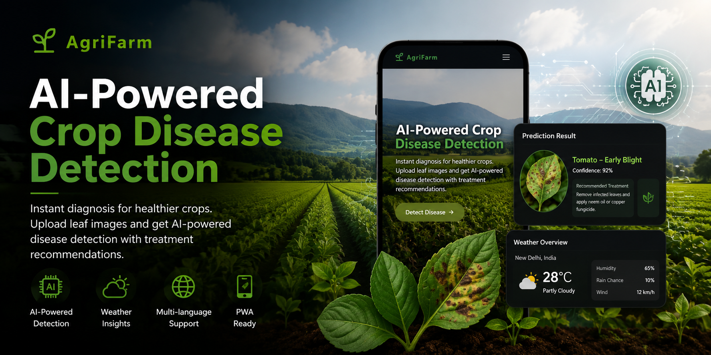

<p align="center">
  
</p>

<div align="center">

# 🌾 AgriFarm – AI Crop Disease Detection Platform

### AI-powered crop disease detection using **TensorFlow.js**, **React**, **Flask**, and **Firebase**

<p align="center">
  <a href="https://crop-disease-detection-woad.vercel.app/">
    
  </a>
  <a href="https://github.com/taslimzafar/AgriFarm-Crop-Disease-Detection">
    
  </a>
</p>

<p>


</p>

An AI-powered web application that helps farmers identify crop diseases by analyzing plant leaf images using machine learning. AgriFarm supports browser-based inference with TensorFlow.js, optional Flask backend inference, offline functionality, multilingual support, and weather-based disease risk estimation.

</div>

---

# 📖 Overview

AgriFarm is a modern AI-powered web application built to assist farmers, agriculture students, and researchers in detecting crop diseases quickly and accurately.

The application performs disease prediction directly in the browser using **TensorFlow.js**, eliminating the need for a server in many cases. For applications requiring server-side inference, AgriFarm also supports an optional **Flask backend**.

Beyond disease detection, the platform provides:

- 🌍 Multi-language support
- 🌤️ Weather-based disease risk estimation
- 📱 Progressive Web App (PWA) capabilities
- 💻 Responsive design for desktop and mobile devices

This project demonstrates how machine learning can be integrated into modern web applications to solve real-world agricultural problems.

---

# 🌐 Live Demo

## 🚀 Try the application here

### https://crop-disease-detection-woad.vercel.app/

---

# ✨ Features

| Feature | Description |
|----------|-------------|
| 🌿 AI Disease Detection | Predicts crop diseases using TensorFlow.js |
| 📷 Image Upload | Upload plant leaf images for instant analysis |
| 🧠 Browser Inference | Machine learning runs directly inside the browser |
| ⚙️ Flask Backend | Optional backend API for server-side prediction |
| 🌤️ Weather Integration | Uses weather data for disease risk estimation |
| 🌍 Multi-language | English, Hindi, and Tamil support |
| 📱 Progressive Web App | Installable with offline support |
| 💻 Responsive UI | Optimized for desktop, tablet, and mobile |

---

# 🛠 Tech Stack

| Category | Technologies |
|-----------|--------------|
| Frontend | React 19, Vite, Tailwind CSS, React Router, Framer Motion |
| Backend | Flask, Python |
| Machine Learning | TensorFlow, TensorFlow.js |
| Cloud Services | Firebase |
| APIs | OpenWeather API |
| Development Tools | Git, GitHub, VS Code |

---

# 🏗 Project Architecture

```text
                   Plant Leaf Image
                          │
                          ▼
                 React Frontend (Vite)
                          │
          ┌───────────────┴───────────────┐
          │                               │
          ▼                               ▼
 TensorFlow.js Model             Flask Backend (Optional)
 (Browser Inference)             Server-side Inference
          │                               │
          └───────────────┬───────────────┘
                          ▼
                 Disease Prediction
                          │
                          ▼
                Results + Weather Data
```

---

# 📂 Project Structure

```text
AgriFarm-Crop-Disease-Detection/
│
├── backend/                 Flask backend API
├── ml/                      Machine learning training notebook
├── public/
│   └── model/               TensorFlow.js model files
│
├── src/
│   ├── components/
│   ├── pages/
│   ├── hooks/
│   ├── context/
│   └── App.jsx
│
├── package.json
├── vite.config.ts
└── README.md
```

---

# 📸 Screenshots

> Replace these placeholders with actual screenshots.

| Home Page | Upload Image |
|-----------|--------------|
|  |  |

| Prediction Result | 
|-------------------|
|  |

---

# 🚀 Getting Started

## Clone the repository

```bash
git clone https://github.com/taslimzafar/AgriFarm-Crop-Disease-Detection.git
```

Move into the project directory

```bash
cd AgriFarm-Crop-Disease-Detection
```

Install dependencies

```bash
npm install
```

Run the development server

```bash
npm run dev
```

The application will be available at

```text
http://localhost:5173
```

---

# ⚙️ Flask Backend (Optional)

Navigate to the backend folder

```bash
cd backend
```

Install dependencies

```bash
pip install -r requirements.txt
```

Run the Flask server

```bash
python app.py
```

Inside the application settings, enter:

```text
http://localhost:5000/predict
```

This enables server-side prediction instead of browser inference.

---

# ⚙️ Runtime Configuration

No rebuild is required.

Open **Settings** inside the application and configure:

| Setting | Example |
|----------|----------|
| TensorFlow.js Model URL | `/model/model.json` |
| Backend Prediction URL | `http://localhost:5000/predict` |
| OpenWeather API Key | Your API Key |

These values override the environment variables for the current device.

---

# 🔐 Environment Variables

Create a `.env` file in the project root.

```env
VITE_TFJS_MODEL_URL=/model/model.json
VITE_BACKEND_INFER_URL=http://localhost:5000/predict
VITE_OPENWEATHER_API_KEY=your_openweather_api_key
```

---

# 🧠 Model Training

The machine learning model can be retrained using the notebook located at

```text
ml/train_plantvillage.ipynb
```

The notebook contains the workflow for preparing the dataset, training the model, and exporting it for TensorFlow.js inference.

---

# 💡 Why AgriFarm?

Crop diseases can significantly reduce agricultural productivity if they are not identified early.

AgriFarm leverages artificial intelligence and modern web technologies to provide fast disease predictions through an accessible and user-friendly interface, helping users make better agricultural decisions without requiring specialized hardware.

---

# 🚀 Future Improvements

- User Authentication
- Prediction History
- Disease Treatment Recommendations
- Prevention Tips
- Prediction Confidence Visualization
- Farmer Dashboard
- Admin Dashboard
- Expert Consultation
- Additional Crop Models
- Mobile Application

---

# 🤝 Contributing

Contributions are always welcome.

1. Fork this repository

2. Create a new branch

```bash
git checkout -b feature-name
```

3. Commit your changes

```bash
git commit -m "Add new feature"
```

4. Push your branch

```bash
git push origin feature-name
```

5. Open a Pull Request

---

# 👨‍💻 Maintainer & Authors

### MD Taslim (taslimzafar)
🔗 GitHub: [https://github.com/taslimzafar](https://github.com/taslimzafar)

### Original Author: Mohammad Fazal
**B.Tech Computer Science Engineering**  
ABES Engineering College  
🔗 GitHub: https://github.com/MFazal231  
🔗 LinkedIn: https://www.linkedin.com/in/mohammad-fazal/  

---

# 📄 License

This project is licensed under the **MIT License**.

---

<div align="center">

## ⭐ If you found this project useful, consider giving it a Star!

It helps others discover the project and motivates further development.

</div>